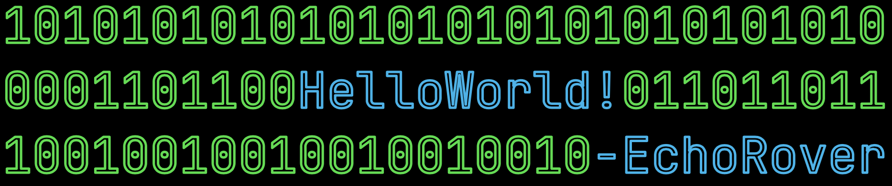

Welcome to My Profile!
-

  

Hi there! I'm Evan, a passionate game, app, and web developer. Welcome to my GitHub profile. Here you'll find information about me and my skills.

About Me
-
I am an enthusiastic developer with a strong focus on game, app, and web development. I have experience working with various programming languages and technologies, but my primary expertise lies in Python, HTML, CSS, JavaScript, and Swift. I enjoy creating immersive experiences and solving complex problems through code. In my free time, I love exploring new technologies and experimenting with innovative ideas.

Skills
---
- Python
- HTML
- CSS
- JavaScript
- Swift

  
Thank You
---
Thank you for visiting my profile. I hope you find my projects and contributions interesting. Feel free to explore my repositories and don't forget to give them a star if you find them useful. Have a great day!

<!---
EchoRover/EchoRover is a ✨ special ✨ repository because its `README.md` (this file) appears on your GitHub profile.
You can click the Preview link to take a look at your changes.
--->
